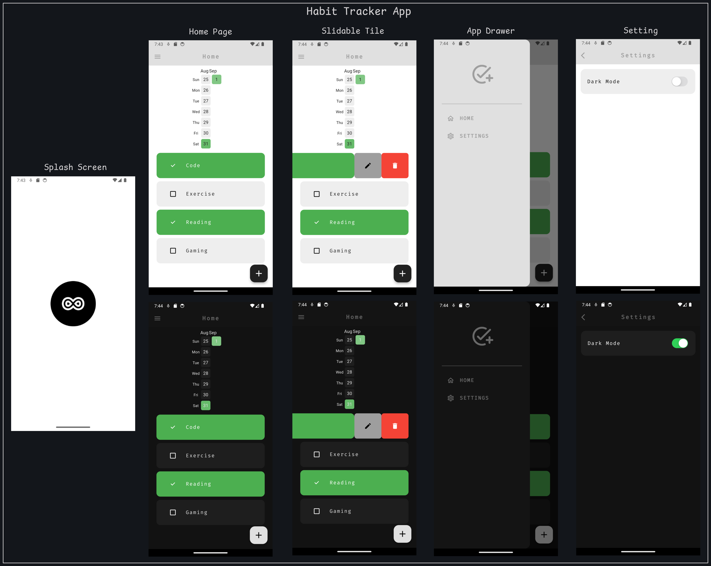

# habit_tracker_app

A Habit trackering application that uses Isar Database to storage the important of the users habits and the dates of the days on which they completed and display them in the form of a Heat Map Calendar.

## Features

The following are the features of this application:

### Change themes

- Switch between light mode and dart mode.

### CRUD Operations

- Create a new habit.
- Read and display habits in real-time.
- Update the habit name.
- Update the habit's completion status.
- Delete the habit and all it's previous record.

### Heat Map Visualization

- Represent the collected data in the form of a GitHub contributions like heat map.

## File Structure

```bash
assets/
│
├── screenshots/           # UI Screenshots
└── app_icon.png           # App Icon
lib/
│
├── components/            # Reusable widgets and UI componets
├── util/                  # Utilities to get completion status and
├── models/                # Data models for the application
├── pages/                 # UI screens for the application
├── database/              # Isar Database Service
├── themes/                # Themes Provider and text themes
└── main.dart              # Main entry point of the application
```

## App Icon

The app icon is made using the following websites:

- [Figma](https://www.figma.com/)
- [App Icon Generator](https://www.appicon.co/)
- [Icon Monstr](https://iconmonstr.com/)


## UI Screens



## Getting Started

### Prerequisites

- Have [Flutter](https://flutter.dev/) installed on your machine.
- Check the documentation of [Isar Database](https://isar.dev/) for more info on it.

### Packages used

- 
- 
- 
- 
- 
- 
- 
- 

### Installation

1. Clone the repository:

```bash
git clone https://github.com/usman619/habit_tracker_app.git
cd habit_tracker_app
code .
```

2. Install the dependencies:

```bash
flutter pub get
```

3. If you want to change default app icon, goto the file 'flutter_launcher_icons.yaml' and change the path used in 'image_path' and after that run the following command in your terminal:

```bash
dart run flutter_launcher_icons:main
```

4. Run using the following command:

```bash
flutter run
```
